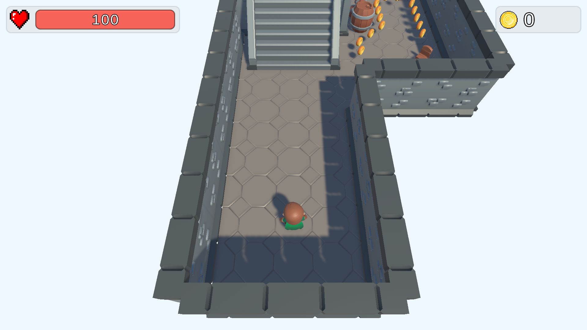
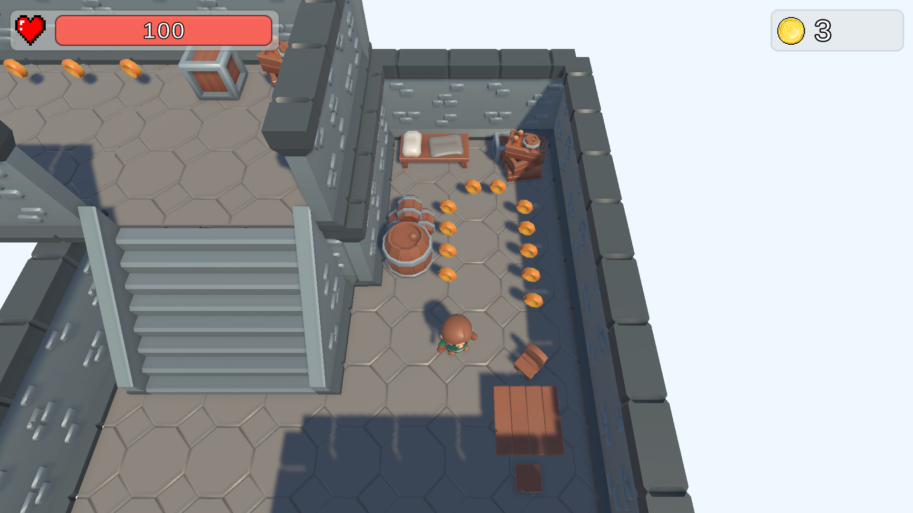
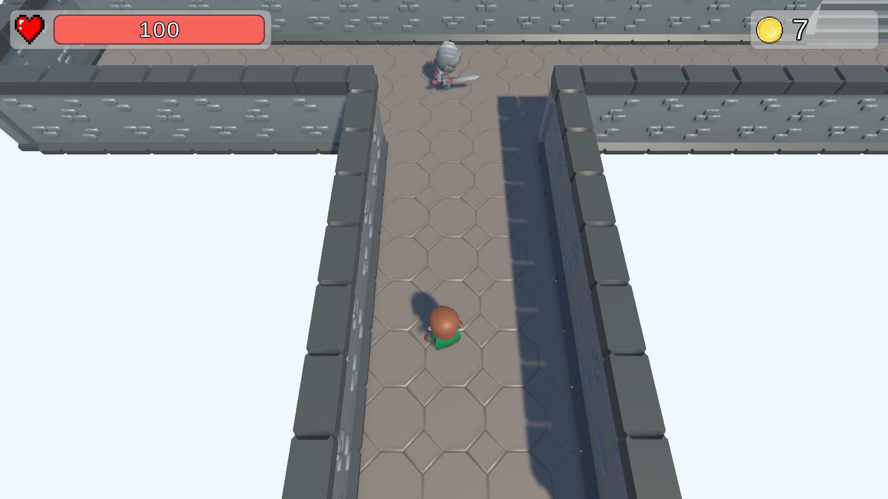
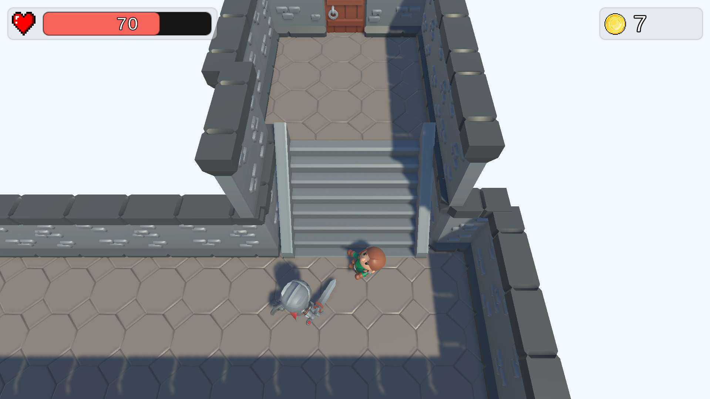
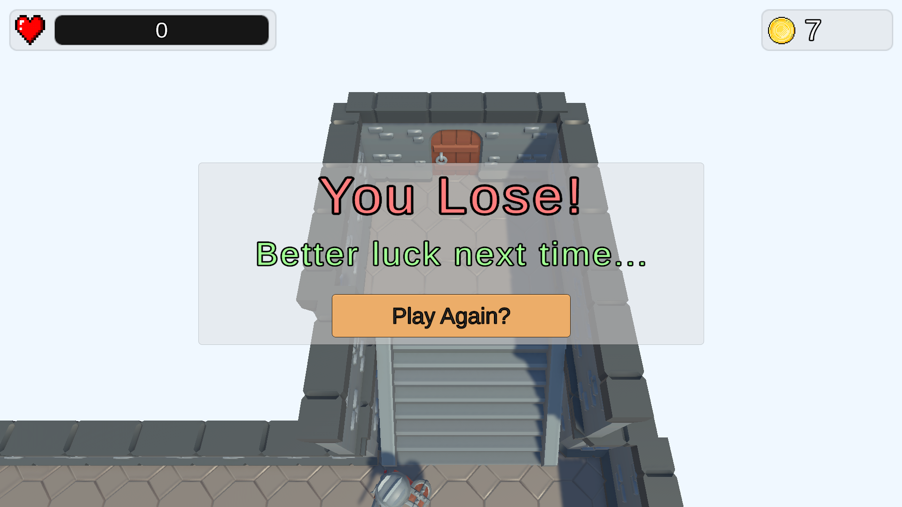

# Escape The Dungeon
## Summary
**Escape The Dungeon** is a Top-Down RPG where you play as a rogue character fighting your way out of the heavily defended dungeons.

## Current State
The game is currently in early development stages where it features only a single prototype level where the player can move around and collect coins while also trying to escape the attacks of a Knight that's patroling the main route to the exit gate.

## How to play?
You can download the latest release from the releases section.
(As of now, only Windows platform is supported)

## Controls
| Action | Input |
| ------ | ----- |
| Left | A [Keyboard]
| Right | D [Keyboard]
| Up | W [Keyboard]
| Down | S [Keyboard]
| Jump | SPACE [Keyboard]

## Screenshots

